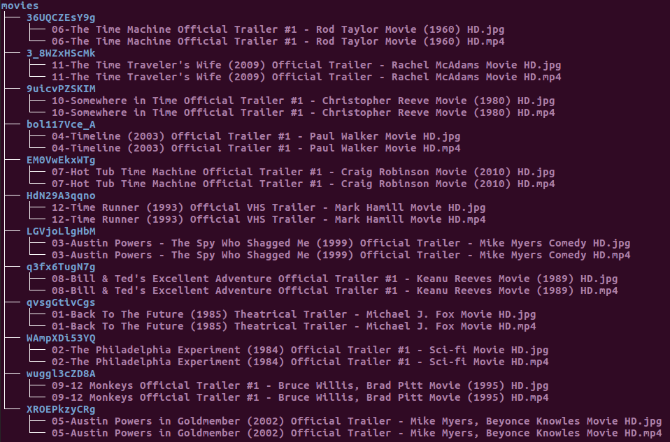
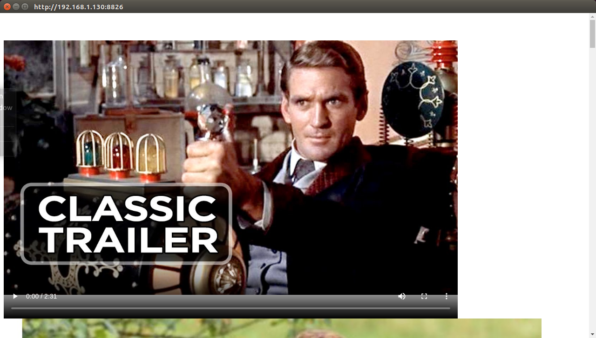
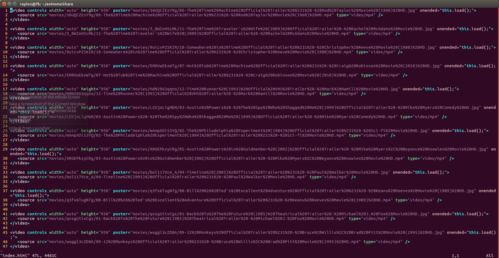

# Requirment
The *avHomeShare App* assumes the existence of a folder called *movies* residing in the same folder of the app. Inside this folder *movie*, sub-folders consisting of a mp4 video and a jpg cover. See a sample below.

These folders with their videos and covers are prepared by using youtube-dl 
> youtube-dl -f mp4 --write-thumbnail  -o '%(id)s/%(playlist_index)s-%(title)s.%(ext)s' https://www.youtube.com/playlist?list=PLYK5kVPCxrpvNWsFb18CX4EK9iKVbT61P
# Purpose
The app will create
1. the file *index.html* in the same folder of the app showing the list of video with cover in each folder.
2. a tiny web server serving this *index.html* using the local ip and a random port from 8001 to 8999.
3. a 1280x720 desktop window browsing at http://(the local ip)/(the random port)
See a sample screenshot below:

See the sample *index.html* of the above sample:

